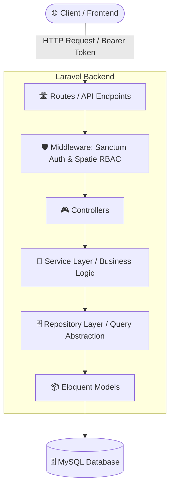

# 🎓 SIA Universitas Suzuran — Sistem Informasi Akademik


SIA (Sistem Informasi Akademik) Universitas Suzuran adalah platform web terpadu untuk mendigitalisasi dan mengotomatisasi seluruh siklus akademik perguruan tinggi. Sistem ini mengintegrasikan tata kelola data fakultas, program studi, dosen, mahasiswa, perkuliahan, Kartu Rencana Studi (KRS), penilaian Kartu Hasil Studi (KHS), presensi/absensi, hingga penjadwalan ujian dengan otorisasi berbasis peran (**Role-Based Access Control / RBAC**).

---

## 📑 Daftar Isi

- [Arsitektur & Pola Desain](#-arsitektur--pola-desain)
- [Teknologi yang Digunakan](#-teknologi-yang-digunakan)
- [Fitur Utama](#-fitur-utama)
- [Aktor & Hak Akses (RBAC)](#-aktor--hak-akses-rbac)
- [Struktur Direktori](#-struktur-direktori)
- [Panduan Instalasi & Menjalankan Aplikasi](#-panduan-instalasi--menjalankan-aplikasi)
  - [Opsi A: Menjalankan Secara Lokal](#opsi-a-menjalankan-secara-lokal-rekomendasi)
  - [Opsi B: Menjalankan dengan Docker](#opsi-b-menjalankan-dengan-docker)
- [Akun Percobaan (Default Seeded Users)](#-akun-percobaan-default-seeded-users)
- [Dokumentasi API Endpoints](#-dokumentasi-api-endpoints)
- [Pengujian (Testing)](#-pengujian-testing)
- [Lisensi](#-lisensi)

---

## 🏛️ Arsitektur & Pola Desain

Aplikasi ini dibangun menggunakan arsitektur **Layered Architecture (Controller-Service-Repository Pattern)** di Laravel untuk memastikan prinsip *Separation of Concerns* (SoC), skalabilitas tinggi, serta kemudahan *unit testing*:



### Penjelasan Lapisan (Layers):
1. **Controller Layer (`app/Http/Controllers/`)**: Menangani validasi request HTTP, format respon JSON, dan meneruskan instruksi ke Service.
2. **Service Layer (`app/Services/`)**: Pusat logika bisnis (perhitungan SKS, kalkulasi nilai IPK/IPS, aturan bisnis enroll kelas, aktivasi semester).
3. **Repository Layer (`app/Repositories/`)**: Mengabstraksi pemanggilan data ke database/Eloquent ORM untuk kemudahan modifikasi query dan *clean code*.
4. **Model Layer (`app/Models/`)**: Representasi entitas data Eloquent dan relasi antar tabel (One-to-Many, Belongs-to-Many / Pivot).

---

## 💻 Teknologi yang Digunakan

| Komponen | Teknologi | Deskripsi |
|---|---|---|
| **Framework Backend** | Laravel 11.x / 12.x | PHP Web Framework modern |
| **Bahasa Pemrograman**| PHP 8.2+ | Server-side runtime |
| **Autentikasi API** | Laravel Sanctum | Token-based Authentication (Bearer Token) |
| **Otorisasi (RBAC)** | Spatie Laravel Permission | Manajemen Peran (`admin`, `dosen`, `mahasiswa`) |
| **Database** | MySQL 8.0+ / MariaDB | Relational Database Management System |
| **Containerization** | Docker & Docker Compose | Container aplikasi dan database MySQL |
| **Testing** | PHPUnit & Pest PHP | Automated test suite |

---

## ✨ Fitur Utama

### 1. 🔐 Autentikasi & Profil Pengguna
- Login berbasis REST API menggunakan token Laravel Sanctum.
- Update data profil (email, nomor telepon, password).
- Upload dan manajemen foto profil pengguna.
- Restorasi sesi login otomatis.

### 2. 📊 Dashboard Interaktif
- **Admin/Dosen**: Statistik total fakultas, program studi, dosen pengajar, mahasiswa aktif, dan kelas perkuliahan.
- **Mahasiswa**: Ringkasan capaian akademik (IPK, IPS semester terakhir, SKS Lulus, dan SKS sedang diambil).

### 3. 🏢 Tata Kelola Master Data (Admin)
- **Fakultas & Program Studi**: CRUD lengkap beserta penetapan jenjang (D3/S1/S2/S3) dan kode prodi.
- **Tahun Akademik**: Manajemen semester ganjil/genap serta toggle aktivasi semester aktif global.
- **Mata Kuliah**: Manajemen bobot SKS, kode unik mata kuliah, dan semester rekomendasi.
- **Dosen & Mahasiswa**: Manajemen data civitas akademika, nomor induk (NIDN/NIM), status mahasiswa (AKTIF, CUTI, LULUS, DO), serta penugasan Dosen Pembimbing Akademik (Dosen PA).

### 4. 📚 Kelas Kuliah & Penjadwalan
- Pengaturan kelas per semester aktif dengan kuota, hari, jam mulai-selesai, dan ruangan kelas.
- Penugasan dosen pengampu per kelas (mendukung *team teaching* / multi-dosen).

### 5. 📝 Registrasi KRS & Penilaian KHS
- Mahasiswa dapat melakukan pendaftaran rencana studi (KRS) pada kelas-kelas yang aktif.
- Dosen/Admin dapat menginput dan memperbarui nilai akhir angka (0–100) serta konversi nilai huruf (A, B, C, D, E).
- Kalkulasi otomatis IPS (Indeks Prestasi Semester) dan IPK (Indeks Prestasi Kumulatif).

### 6. 📅 Presensi Kuliah & Ujian
- **Absensi Pertemuan**: Dosen dapat mengaktifkan pertemuan kelas dan merekam status presensi kehadiran mahasiswa (Hadir, Izin, Sakit, Alpa).
- **Ujian Kelas**: Pengelolaan jadwal ujian tengah/akhir semester (UTS/UAS) serta bobot penilaian.

---

## 👥 Aktor & Hak Akses (RBAC)

| Modul / Kemampuan | Admin | Dosen | Mahasiswa |
|---|:---:|:---:|:---:|
| **Kelola Master Data (Fakultas, Prodi, TA, MK)** | ✅ Penuh | ❌ | ❌ |
| **Kelola Data Dosen & Mahasiswa** | ✅ Penuh | ❌ (Hanya Profil Diri) | ❌ (Hanya Profil Diri) |
| **Kelola Kelas Kuliah & Plot Pengampu** | ✅ Penuh | 👁️ Lihat Kelas Diampu | 👁️ Lihat Kelas Diambil |
| **Registrasi KRS (Ambil Kelas)** | ✅ | ❌ | ✅ |
| **Input & Koreksi Nilai KHS** | ✅ | ✅ (Kelas yang Diampu) | ❌ (Hanya Melihat) |
| **Kelola Presensi Pertemuan Kelas** | ✅ | ✅ (Kelas yang Diampu) | 👁️ Lihat Kehadiran |
| **Kelola Jadwal & Nilai Ujian** | ✅ | ✅ (Kelas yang Diampu) | 👁️ Lihat Jadwal Ujian |
| **Bimbingan Akademik (Daftar Mahasiswa PA)** | ✅ | ✅ (Mahasiswa Bimbingan) | 👁️ Lihat Dosen PA |

---

## 📁 Struktur Direktori

```text
siauniversitassuzuran2/
├── app/
│   ├── Helpers/                 # Helper fungsi kustom
│   ├── Http/
│   │   ├── Controllers/         # Endpoint request handlers
│   │   └── Middleware/          # Middleware autentikasi & RBAC
│   ├── Models/                  # Eloquent Models (User, Mahasiswa, Dosen, Kelas, dll)
│   ├── Providers/               # Service Providers Laravel
│   ├── Repositories/            # Data Access & Database Query Layer
│   └── Services/                # Core Business Logic Layer
├── bootstrap/                   # Laravel bootstrap & application configuration
├── config/                      # File konfigurasi aplikasi, auth, permission, database
├── database/
│   ├── migrations/              # Skema tabel database (termasuk index performa)
│   └── seeders/                 # Data seeder komprehensif (Dummy users, dosen, mhs)
├── docker-compose.yml           # Orkestrasi Docker container (App + MySQL)
├── dockerfile                   # Definisi image PHP/Laravel
├── frontend/                    # Source code komponen frontend / UI
│   └── src/
│       ├── assets/              # File style CSS & aset statis
│       └── components/          # Komponen antarmuka pengguna
├── public/                      # Web root / aset publik
├── routes/
│   ├── api.php                  # Seluruh route API RESTful
│   ├── console.php              # Definisi command artisan
│   └── web.php                  # Web route / fallback view
├── tests/                       # Unit dan Feature testing (Pest / PHPUnit)
├── .env.example                 # Template variabel lingkungan
└── composer.json                # Dependensi paket PHP
```

---

## 🚀 Panduan Instalasi & Menjalankan Aplikasi

### Opsi A: Menjalankan Secara Lokal (Rekomendasi)

#### 1. Prasyarat
- PHP >= 8.2 (dengan ekstensi `pdo_mysql`, `mbstring`, `openssl`, `bcmath`, `curl`)
- Composer >= 2.x
- MySQL >= 8.0 atau MariaDB >= 10.4
- Node.js >= 18.x & NPM (jika mengkompilasi frontend)

#### 2. Kloning & Instal Dependensi
```bash
# Masuk ke direktori proyek
cd siauniversitassuzuran2

# Install dependensi PHP
composer install
```

#### 3. Konfigurasi File `.env`
Salin file konfigurasi lingkungan:
```bash
cp .env.example .env
```
Sesuaikan konfigurasi database pada file `.env`:
```env
DB_CONNECTION=mysql
DB_HOST=127.0.0.1
DB_PORT=3306
DB_DATABASE=siauniversitassuzuran
DB_USERNAME=root
DB_PASSWORD=
```

#### 4. Generate Application Key & Storage Link
```bash
php artisan key:generate
php artisan storage:link
```

#### 5. Eksekusi Migrasi & Seeder Database
Jalankan migrasi untuk membuat tabel dan mengisi data awal (*dummy records* civitas akademika lengkap):
```bash
php artisan migrate:fresh --seed
```

#### 6. Jalankan Server Pengembangan
```bash
php artisan serve
```
Aplikasi backend API akan berjalan di: `http://127.0.0.1:8000`

---

### Opsi B: Menjalankan dengan Docker

Proyek ini telah dilengkapi dengan konfigurasi `dockerfile` dan `docker-compose.yml`.

1. **Jalankan container**:
   ```bash
   docker compose up -d --build
   ```
2. **Jalankan migrasi di dalam container aplikasi**:
   ```bash
   docker compose exec app php artisan migrate:fresh --seed
   docker compose exec app php artisan storage:link
   ```
3. Akses aplikasi:
   - Backend API: `http://localhost:8000`
   - MySQL Database: `localhost:3307` (User: `root`, Password: `1234`, Database: `siauniversitassuzuran`)

---

## 🔑 Akun Percobaan (Default Seeded Users)

Seluruh akun default hasil seeding menggunakan password seragam: **`password123`**

| Role | Email Login | Keterangan |
|---|---|---|
| **Admin** | `admin@kampus.ac.id` | Memiliki hak akses penuh ke seluruh modul master data dan transaksi |
| **Dosen** | `dosen.1@kampus.ac.id` s/d `dosen.50@kampus.ac.id` | Akses Portal Dosen, input nilai kelas, presensi, dan bimbingan PA |
| **Mahasiswa** | `mhs.1@kampus.ac.id` s/d `mhs.250@kampus.ac.id` | Akses Portal Mahasiswa, KRS, KHS, jadwal perkuliahan |

---

## 📡 Dokumentasi API Endpoints

Semua request yang membutuhkan autentikasi wajib menyertakan header:  
`Authorization: Bearer <token_sanctum>`  
`Accept: application/json`

### 1. Autentikasi (`/api`)
| Method | Endpoint | Hak Akses | Deskripsi |
|---|---|---|---|
| `POST` | `/api/login` | Publik | Autentikasi email & password, mengembalikan token Sanctum |
| `POST` | `/api/logout` | Authenticated | Menghapus token sesi aktif |
| `GET` | `/api/user` | Authenticated | Mengambil informasi detail profil user yang sedang login |
| `POST` | `/api/profile/update` | Authenticated | Memperbarui informasi profil, telepon, password, atau foto |

### 2. Master Data Fakultas & Prodi (`/api`)
| Method | Endpoint | Hak Akses | Deskripsi |
|---|---|---|---|
| `GET` | `/api/faculties` | All Auth | Mengambil daftar seluruh fakultas |
| `POST` | `/api/faculties` | Admin | Menambah fakultas baru |
| `GET` | `/api/faculties/{id}` | All Auth | Detail fakultas |
| `PUT` | `/api/faculties/{id}` | Admin | Memperbarui data fakultas |
| `DELETE` | `/api/faculties/{id}` | Admin | Menghapus data fakultas |
| `GET` | `/api/study-programs` | All Auth | Mengambil daftar program studi |
| `POST` | `/api/study-programs` | Admin | Menambah program studi baru |
| `PUT` | `/api/study-programs/{id}` | Admin | Mengubah data program studi |
| `DELETE` | `/api/study-programs/{id}` | Admin | Menghapus data program studi |

### 3. Civitas Akademika (`/api`)
| Method | Endpoint | Hak Akses | Deskripsi |
|---|---|---|---|
| `GET` | `/api/lecturers` | All Auth | Daftar seluruh dosen |
| `POST` | `/api/lecturers` | Admin | Menambah data dosen |
| `GET` | `/api/lecturers/{id}` | All Auth | Detail dosen |
| `GET` | `/api/lecturers/{id}/kelas-kuliah-aktif` | All Auth | Daftar kelas aktif yang diampu dosen |
| `GET` | `/api/lecturers/{id}/mahasiswa-bimbingan` | All Auth | Daftar mahasiswa bimbingan PA |
| `GET` | `/api/students` | All Auth | Daftar seluruh mahasiswa |
| `POST` | `/api/students` | Admin | Menambah data mahasiswa |
| `GET` | `/api/students/{id}` | All Auth | Detail mahasiswa & data akademik |

### 4. Perkuliahan & KRS/KHS (`/api`)
| Method | Endpoint | Hak Akses | Deskripsi |
|---|---|---|---|
| `GET` | `/api/courses` | All Auth | Daftar mata kuliah |
| `GET` | `/api/academic-years` | All Auth | Daftar tahun akademik |
| `GET` | `/api/course-classes` | All Auth | Daftar kelas kuliah & jadwal |
| `POST` | `/api/course-classes` | Admin | Membuat kelas kuliah baru |
| `GET` | `/api/enrollments` | All Auth | Daftar KRS / Kelas Mahasiswa |
| `POST` | `/api/enrollments` | Mahasiswa / Admin | Registrasi kelas kuliah (Ambil KRS) |
| `PUT` | `/api/enrollments/{id}` | Dosen / Admin | Input/update nilai akhir & nilai huruf |
| `DELETE` | `/api/enrollments/{id}` | Admin | Batalkan enrollment kelas |

### 5. Presensi & Ujian (`/api`)
| Method | Endpoint | Hak Akses | Deskripsi |
|---|---|---|---|
| `GET` | `/api/absensis` | All Auth | Mengambil data presensi perkuliahan |
| `POST` | `/api/absensis` | Dosen / Admin | Merekam kehadiran mahasiswa |
| `POST` | `/api/absensis/activate` | Dosen / Admin | Mengaktifkan sesi pertemuan kelas |
| `GET` | `/api/exams` | Dosen / Admin | Mengambil daftar jadwal ujian kelas |
| `POST` | `/api/exams` | Dosen / Admin | Membuat agenda ujian kelas baru |
| `DELETE` | `/api/exams/{id}` | Dosen / Admin | Menghapus agenda ujian kelas |

---

## 🧪 Pengujian (Testing)

Proyek ini telah dilengkapi dengan *automated testing* untuk memastikan kestabilan endpoint dan logika bisnis.

Jalankan test suite menggunakan perintah:
```bash
php artisan test
```
atau menggunakan PHPUnit:
```bash
./vendor/bin/phpunit
```

---

## 📄 Lisensi

Proyek SIA Universitas Suzuran dikembangkan di bawah lisensi [MIT License](https://opensource.org/licenses/MIT).
